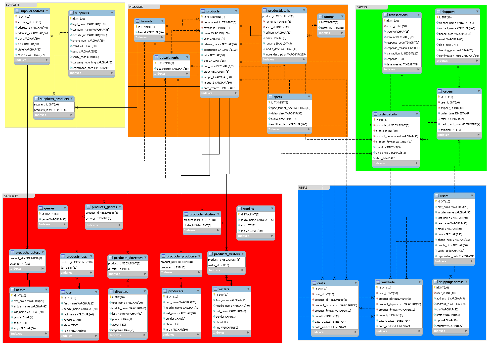
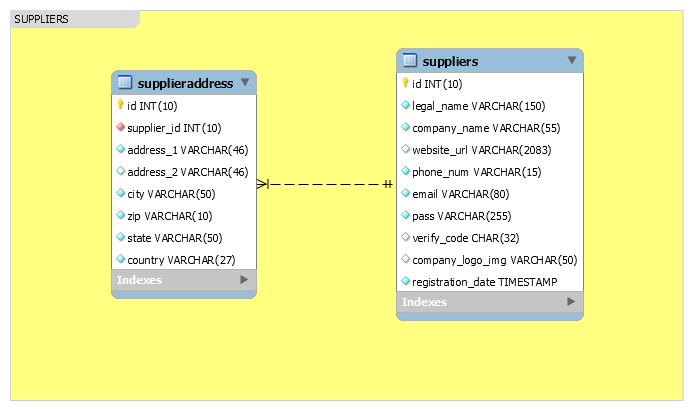
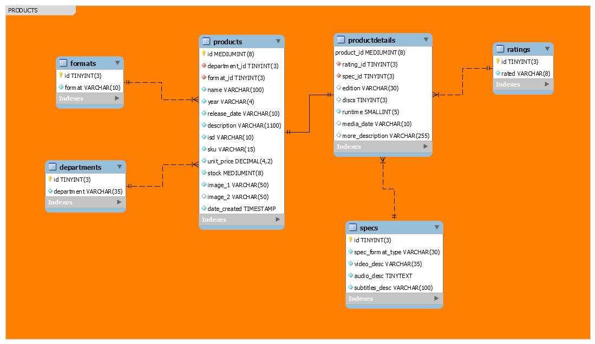
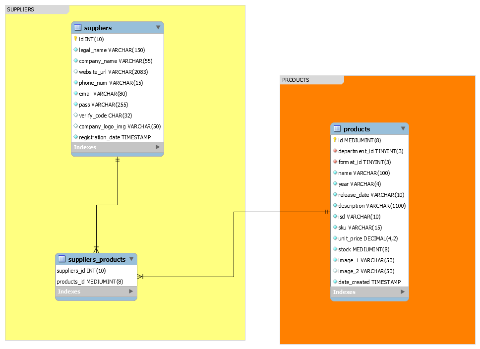
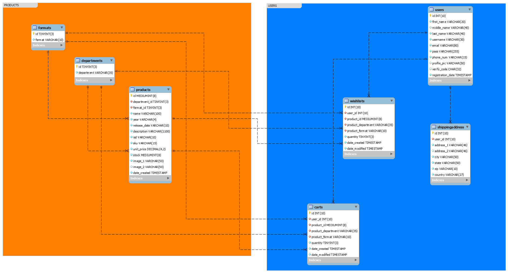
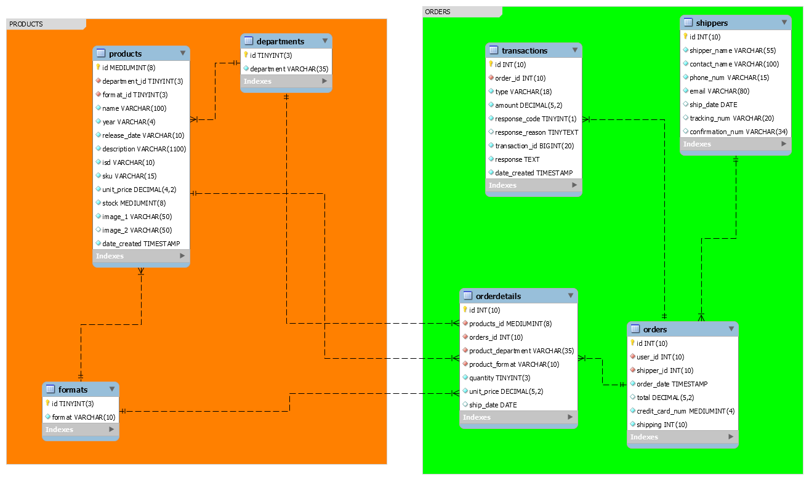
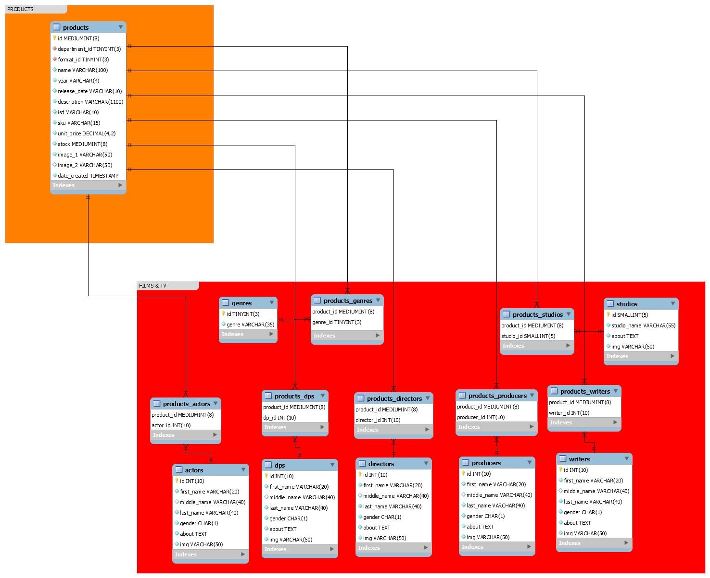

# Film eCommerce Database

Here is the entire database that was created for this project from the architecture that is Normalized and follows the rules of 1NF, 2NF, and 3NF where NF stands for Normal Forms. After the creation of the architecture are the datatypes which are to store the data in the tables. In total, there are 31 tables:



Stored procedures well be created, and after it is created is when this README file well be updated to describe it. The `filmecommerce.sql` well also be updated after the stored procedures are created.

I used MariaDB to make the databases and datatypes, and I downloaded the `filmecommerce.sql` from phpMyAdmin. Lastly, I used MySQL Workbench to create EER diagrams and save it as `.png`.

The idea behind this was to use a Movie-like Database that stores all the information of the available Films, TV, Actors, Directors, Studios, etc. that is associated with that particular product (after all, Films and Television Shows are considered a product with market values in terms of the Entertainment Industry). Since this project deals with the people who participated on making that product, it would be fitting to use a Movie-like Database that stores all their information including their profile pictures that would be used. The user would see what other Movies and/or TV Shows that the Studios, Directors, Cinematographers, etc. have also been in, and the user would potentially buy it. They would also see their biographies when they click on the particular artists/company link. The user would also be given an option to see the years they were in, and more importantly, the user would be given an option to see a particular gender.

Of course, since this is an eCommerce website (or project), the major component of it is the eCommerce side from the Suppliers to the Users and to the Orders. In combination of the Movie-like Database and an eCommerce Database, this would be used to give a very informative website from buying to exploring an actor's other participated films as well as reading their humble beginnings. More importantly, this was made to give respect to the people in the Entertainment Industry since they have worked so hard to change all of our lives culturally to politically from all over the world, and to so many great generations from the past to the unknown future.

---

### SUPPLIERS

---

First up is the `SUPPLIERS` section which contains tables of the `suppliers` and `supplieraddress`. The image for the schema are provided below:



For the `suppliers` table, a `legal_name` of length 150 characters is the max in case there are those whom have a last name and middle name that are long. The company's website (`website_url`) and its logo picture (`company_logo_img`) are set to `NULL` as an option for the supplier to provide. The `verify_code` is also set to `NULL` once the supplier verifies their registration code through their email. The `registration_date` is set to `TIMESTAMP` where the supplier first registered. Everything else the supplier has to provide as they are set to `NOT NULL`:

```sh
CREATE TABLE suppliers (
    id INT(10) UNSIGNED NOT NULL AUTO_INCREMENT,
    legal_name VARCHAR(150) NOT NULL,
    company_name VARCHAR(55) NOT NULL,
    website_url VARCHAR(2083) DEFAULT NULL,
    phone_num VARCHAR(15) NOT NULL,
    email VARCHAR(80) NOT NULL,
    pass VARCHAR(255) NOT NULL,
    verify_code CHAR(32),
    company_logo_img VARCHAR(50) DEFAULT NULL,
    registration_date TIMESTAMP NOT NULL DEFAULT CURRENT_TIMESTAMP,
    PRIMARY KEY (id),
    UNIQUE (email),
    UNIQUE (pass)
) ENGINE = INNODB DEFAULT CHARSET = utf8;
```

For the `supplieraddress` table, it has a One-to-Many relationship from `suppliers` table where `supplier_id` acts as a foreign key. All the inputs from the suppliers are required except for `address_2` where that is set to `NULL` in case that supplier does not have a secondary address:

```sh
CREATE TABLE supplieraddress (
    id INT(10) UNSIGNED NOT NULL AUTO_INCREMENT,
    supplier_id INT(10) UNSIGNED NOT NULL,
    address_1 VARCHAR(46) NOT NULL,
    address_2 VARCHAR(46) DEFAULT NULL,
    city VARCHAR(50) NOT NULL,
    zip VARCHAR(10) NOT NULL,
    state VARCHAR(50) NOT NULL,
    country VARCHAR(27) NOT NULL,
    PRIMARY KEY (id),
    FOREIGN KEY (supplier_id) REFERENCES suppliers(id)
) ENGINE = INNODB DEFAULT CHARSET = utf8;
```

---

### PRODUCTS

---

Next is the `PRODUCTS` section which contains tables of the `products`, `productdetails`, `ratings`, `specs`, `departments`, and `formats`. The image for the schema are provided below:



Before creating the `products` table, the `formats` and `departments` table needs to be created first in order to reference it in the `products` table. If not, then there would be an error since the foreign keys have nothing to reference to. The available formats for `formats(format)` are `Blu-ray`, `4K UHD`, and `DVD`. The department for `departments(department)` are `Movies` and `TV`. The year in `products(year)` is 4 characters long when the product was released in the year i.e. 1994. The `products(release_date)` was when the product was released in full-date theatrically i.e. 01/01/1991. The `products(isd)` is a 10-character alphanumeric that is similar to Amazon's ASIN (Amazon Standard Identification Number); it is used for inventory management for the company (if this were to go live). The `products(sku)` is the inventory management for the supplier. The `products(description)` is the description of the product with a max character length of 1100 if the synopsis were to be long. The `products(stock)` is an integer value of how much is in stock; if the availability of the product from the supplier is less than or equal to the physical amount, then it is not available. The suppliers must provide an image for `products(image_1)`, but it is optional for `products(image_2)`. Lastly, no two `isd` in `products` table should be the same:

```sh
CREATE TABLE formats (
    id TINYINT(3) UNSIGNED NOT NULL AUTO_INCREMENT,
    format VARCHAR(10) NOT NULL,
    PRIMARY (id),
    UNIQUE (format)
) ENGINE = INNODB DEFAULT CHARSET = utf8;
```

```sh
CREATE TABLE departments (
    id TINYINT(3) UNSIGNED NOT NULL AUTO_INCREMENT,
    department VARCHAR(35) NOT NULL,
    PRIMARY KEY (id),
    UNIQUE (department)
) ENGINE = INNODB DEFAULT CHARSET = utf8;
```

```sh
CREATE TABLE products (
    id MEDIUMINT(8) UNSIGNED NOT NULL AUTO_INCREMENT,
    department_id TINYINT(3) UNSIGNED NOT NULL,
    format_id TINYINT(3) UNSIGNED NOT NULL,
    name VARCHAR(100) NOT NULL,
    year VARCHAR(4) NOT NULL,
    release_date VARCHAR(10) NOT NULL,
    description VARCHAR(1100) NOT NULL,
    isd VARCHAR(10) NOT NULL,
    sku VARCHAR(15) NOT NULL,
    unit_price DECIMAL(4,2) UNSIGNED NOT NULL DEFAULT 0.0,
    stock MEDIUMINT(8) UNSIGNED NOT NULL DEFAULT 0,
    image_1 VARCHAR(50) NOT NULL,
    image_2 VARCHAR(50) DEFAULT NULL,
    date_created TIMESTAMP NOT NULL DEFAULT CURRENT_TIMESTAMP,
    PRIMARY KEY (id),
    FOREIGN KEY (department_id) REFERENCES departments(id),
    FOREIGN KEY (format_id) REFERENCES formats(id),
    INDEX (department_id),
    INDEX (format_id),
    UNIQUE (isd)
) ENGINE = INNODB DEFAULT CHARSET = utf8;
```

Then, a `ratings` table and `specs` table are created which have extra information for the `productdetails` table. Once these two tables are created, the `productdetails` table is created which has two One-to-Many relationships from the `ratings` table and `specs` table where they act as foreign key references of `rating_id` and `spec_id`, respectively. The `productdetails` table also has a One-to-One relationship to the `products` table where `productdetails(id)` acts as both a primary key and reference key.

The type of ratings given by the MPAA for `ratings(rated)` are `G`, `PG`, `PG-13`, `R`, `NC-17`, `NR`, `Unrated`, `TV-Y`, `TV-Y7`, `TV-G`, `TV-PG`, `TV-14`, and `TV-MA`.

The `specs(spec_format_type)` is the title for the particular disc format specifications i.e. "Blu-ray Disc Specifications" or "DVD Specifications". The `specs(video_desc)` is the video description for the particular format i.e. "1080p High Definition 2.40:1". The `specs(audio_desc)` is the description of the given audio for the format i.e. "Dolby Digital 5.1", and the datatype is `TINYTEXT` since there could be a lot of information for the audio. The `specs(subtitles_desc)` is the subtitle description. All of the columns are not set to `NULL` as the suppliers have to give a full rundown for the customers (or users).

The `productdetails(edition)` is the type of edition i.e. "Limited Edition", and it is set to `NULL` as an option for the supplier to provide. The `productdetails(discs)` is the number of discs the product has in integer format, and it is also set to `NULL`. The `productdetails(runtime)` is the length of the product in minutes. The `productdetails(media_date)` is the product's home media release date. Lastly, `productdetails(more_description)` is an optional extra description of what the product has (also set to `NULL`):

```sh
CREATE TABLE ratings (
    id TINYINT(3) UNSIGNED NOT NULL AUTO_INCREMENT,
    rated VARCHAR(8) NOT NULL,
    PRIMARY KEY (id),
    UNIQUE (rated)
) ENGINE = INNODB DEFAULT CHARSET = utf8;
```

```sh
CREATE TABLE specs (
    id TINYINT(3) UNSIGNED NOT NULL AUTO_INCREMENT,
    spec_format_type VARCHAR(30) NOT NULL,
    video_desc VARCHAR(35) NOT NULL,
    audio_desc TINYTEXT NOT NULL,
    subtitles_desc VARCHAR(100) NOT NULL,
    PRIMARY KEY (id)
) ENGINE = INNODB DEFAULT CHARSET = utf8;
```

```sh
CREATE TABLE productdetails (
    id MEDIUMINT(8) UNSIGNED NOT NULL AUTO_INCREMENT,
    rated_id TINYINT(3) UNSIGNED NOT NULL,
    spec_id TINYINT(3) UNSIGNED NOT NULL,
    edition VARCHAR(30) DEFAULT NULL,
    discs TINYINT(3) UNSIGNED DEFAULT NULL,
    runtime SMALLINT(5) UNSIGNED NOT NULL,
    media_date VARCHAR(10) DEFAULT NULL,
    more_description VARCHAR(255) DEFAULT NULL,
    PRIMARY KEY (id),
    FOREIGN KEY (id) REFERENCES products(id),
    FOREIGN KEY (rated_id) REFERENCES ratings(id),
    FOREIGN KEY (spec_id) REFERENCES specs(id),
    INDEX (id),
    INDEX (rated_id),
    INDEX (spec_id)
) ENGINE = INNODB DEFAULT CHARSET = utf8;
```

Once this is done, a Many-to-Many relationship table between the `suppliers` table and `products` table is created (`suppliers_products`) where both are the primary keys and foreign keys. There can be as many products to a supplier, and there can also be many suppliers to a product. The image schema and SQL code is provided below:



```sh
CREATE TABLE suppliers_products (
    supplier_id INT(10) UNSIGNED NOT NULL,
    product_id MEDIUMINT(8) UNSIGNED NOT NULL,
    PRIMARY KEY (supplier_id, product_id),
    FOREIGN KEY (supplier_id) REFERENCES suppliers(id),
    FOREIGN KEY (product_id) REFERENCES products(id),
    INDEX (supplier_id),
    INDEX (product_id)
) ENGINE = INNODB DEFAULT CHARSET = utf8;
```

---

### USERS

---

Next comes the `USERS` section which contains tables of the `users`, the user's `shippingaddress`, the user's `wishlists`, and the user's `carts`. The image for the schema are provided below along with some of the tables in the `PRODUCTS` section that are involved as foreign keys:



The `users` table contains the following with `UNIQUE` keys for `username`, `email`, and `pass` (password) since the table cannot contain duplicates for registered users. The `middle_name` and `profile_pic` are optional. The `registration_date` is when the user first registered set to `TIMESTAMP`. Lastly, the `verify_code` is set to `NULL` once the user verifies their account through their email address:

```sh
CREATE TABLE users (
    id INT(10) UNSIGNED NOT NULL AUTO_INCREMENT,
    first_name VARCHAR(20) NOT NULL,
    middle_name VARCHAR(40) DEFAULT NULL,
    last_name VARCHAR(40) NOT NULL,
    username VARCHAR(30) NOT NULL,
    email VARCHAR(80) NOT NULL,
    pass VARCHAR(255) NOT NULL,
    phone_num VARCHAR(15) NOT NULL,
    profile_pic VARCHAR(50) DEFAULT NULL,
    verify_code CHAR(32),
    registration_date TIMESTAMP NOT NULL DEFAULT CURRENT_TIMESTAMP,
    PRIMARY KEY (id),
    UNIQUE (username),
    UNIQUE (email),
    UNIQUE (pass)
) ENGINE = INNODB DEFAULT CHARSET = utf8;
```

Then, the `shippingaddress` table is made which has a foreign key of `user_id` refereced from the `users` table:

```sh
CREATE TABLE shippingaddress (
    id INT(10) UNSIGNED NOT NULL AUTO_INCREMENT,
    user_id INT(10) UNSIGNED NOT NULL,
    address_1 VARCHAR(46) NOT NULL,
    address_2 VARCHAR(46) DEFAULT NULL,
    city VARCHAR(50) NOT NULL,
    state VARCHAR(50) NOT NULL,
    zip VARCHAR(10) NOT NULL,
    country VARCHAR(27) NOT NULL,
    PRIMARY KEY (id),
    FOREIGN KEY (user_id) REFERENCES users(id),
    INDEX (user_id)
) ENGINE = INNODB DEFAULT CHARSET = utf8;
```

After the `users` table and the user's `shippingaddress` table has been established, the tables of `carts` and `wishlists` are created which both have the same datatypes. They both have foreign keys of `user_id`, `product_id`, `product_department`, and `product_format` from tables `users`, `products`, `departments`, and `formats`, respectively. Something to remember is that tables need to be created first before referencing them as foreign keys i.e. the tables `products`, `departments`, and `formats`; the table `users` has already been established as stated earlier in this paragraph. The `date_created` is when the user created their products while `date_modified` is when the user modified their products for both tables of `carts` and `wishlists`. Last but not least, the user has an option on the amount of quantities for the same product in `carts(quantity)` and `wishlists(quantity)`. Onwards:

```sh
CREATE TABLE carts (
    id INT(10) UNSIGNED NOT NULL AUTO_INCREMENT,
    user_id INT(10) UNSIGNED NOT NULL,
    product_id MEDIUMINT(8) UNSIGNED NOT NULL,
    product_department VARCHAR(35) NOT NULL,
    product_format VARCHAR(10) NOT NULL,
    quantity TINYINT(3) UNSIGNED NOT NULL,
    date_created TIMESTAMP NOT NULL DEFAULT CURRENT_TIMESTAMP,
    date_modified TIMESTAMP NOT NULL DEFAULT '0000-00-00 00:00:00',
    PRIMARY KEY (id),
    FOREIGN KEY (user_id) REFERENCES users(id),
    FOREIGN KEY (product_id) REFERENCES products(id),
    FOREIGN KEY (product_department) REFERENCES departments(department),
    FOREIGN KEY (product_format) REFERENCES formats(format),
    INDEX (user_id),
    INDEX (product_id),
    INDEX (product_department),
    INDEX (product_format)
) ENGINE = INNODB DEFAULT CHARSET = utf8;
```

```sh
CREATE TABLE wishlists (
    id INT(10) UNSIGNED NOT NULL AUTO_INCREMENT,
    user_id INT(10) UNSIGNED NOT NULL,
    product_id MEDIUMINT(8) UNSIGNED NOT NULL,
    product_department VARCHAR(35) NOT NULL,
    product_format VARCHAR(10) NOT NULL,
    quantity TINYINT(3) UNSIGNED NOT NULL,
    date_created TIMESTAMP NOT NULL DEFAULT CURRENT_TIMESTAMP,
    date_modified TIMESTAMP NOT NULL DEFAUL '0000-00-00 00:00:00',
    PRIMARY KEY (id),
    FOREIGN KEY (user_id) REFERENCES users(id),
    FOREIGN KEY (product_id) REFERENCES products(id),
    FOREIGN KEY (product_department) REFERENCES departments(department),
    FOREIGN KEY (product_format) REFERENCES formats(format),
    INDEX (user_id),
    INDEX (product_id),
    INDEX (product_department),
    INDEX (product_format)
) ENGINE = INNODB DEFAULT CHARSET = utf8;
```

---

### ORDERS

---

Next comes the `ORDERS` section where it contains the tables of `orders`, `orderdetails`, `shippers`, and `transactions`. The image for the schema is provided below along with some of the tables in the `PRODUCTS` section that are involved:



Before creating the `orders` table, the `shippers` table needs to be established so it could be referenced (which is `shippers(id)`). The `shippers(shipper_name)` is the company name while `shippers(contact_name)` is the name of the person to contact. The `shippers(ship_date)` is when the shipper has shipped the package, and it is set to `NULL` until the shipper has shipped it. The `shippers(tracking_num)` is the tracking number for the user and shipper to know and follow the location of the package. The `shippers(confirmation_num)` is the confirmation number on confirming that it has been sent. Lastly, the last two columns are set to `NULL` until the shipper has provided otherwise:

```sh
CREATE TABLE shippers (
    id INT(10) UNSIGNED NOT NULL AUTO_INCREMENT,
    shipper_name VARCHAR(55) NOT NULL,
    contact_name VARCHAR(100) NOT NULL,
    phone_num VARCHAR(15) NOT NULL,
    email VARCHAR(80) NOT NULL,
    ship_date DATE DEFAULT NULL,
    tracking_num VARCHAR(20) DEFAULT NULL,
    confirmation_num VARCHAR(34) DEFAULT NULL,
    PRIMARY KEY (id),
) ENGINE = INNODB DEFAULT CHARSET = utf8;
```

Then, the `orders` table is created where the foreign keys are `user_id` and `shipper_id` which are being referenced from the tables `users` and `shippers`, respectively. The `ordered_date` is when the user placed the order; the `credit_card_num` is the user's credit card number by not storing the full numbers, but the last four digits; and `shipping` is the cost of shipping:

```sh
CREATE TABLE orders (
    id INT(10) UNSIGNED NOT NULL AUTO_INCREMENTED,
    user_id INT(10) UNSIGNED NOT NULL,
    shipper_id INT(10) UNSIGNED NOT NULL,
    ordered_date TIMESTAMP NOT NULL DEFAULT CURRENT_TIMESTAMP,
    total DECIMAL(5,2) UNSIGNED DEFAULT NULL,
    credit_card_num MEDIUMINT(4) ZEROFILL UNSIGNED NOT NULL,
    shipping INT(10) UNSIGNED NOT NULL DEFAULT 0,
    PRIMARY KEY (id),
    FOREIGN KEY (user_id) REFERENCES users(id),
    FOREIGN KEY (shipper_id) REFERENCES shippers(id),
    INDEX (user_id),
    INDEX (shipper_id)
) ENGINE = INNODB DEFAULT CHARSET = utf8;
```

After this comes the creation of `orderdetails` table which have foreign keys `product_id`, `order_id`, `product_department`, and `product_format` from table references `products`, `orders`, `departments`, and `formats`, respectively:

```sh
CREATE TABLE orderdetails (
    id INT(10) UNSIGNED NOT NULL AUTO_INCREMENT,
    product_id MEDIUMINT(8) UNSIGNED NOT NULL,
    order_id INT(10) UNSIGNED NOT NULL,
    product_department VARCHAR(35) NOT NULL,
    product_format VARCHAR(10) NOT NULL,
    quantity TINYINT(3) UNSIGNED NOT NULL,
    unit_price DECIMAL(5,2) UNSIGNED NOT NULL,
    PRIMARY KEY (id),
    FOREIGN KEY (product_id) REFERENCES products(id),
    FOREIGN KEY (order_id) REFERENCES orders(id),
    FOREIGN KEY (product_department) REFERENCES departments(department),
    FOREIGN KEY (product_format) REFERENCES formats(format),
    INDEX (product_id),
    INDEX (order_id),
    INDEX (product_department),
    INDEX (product_format)
) ENGINE = INNODB DEFAULT CHARSET = utf8;
```

Last but not least for the `ORDERS` section is a table `transactions` which has a foreign key of `order_id` from the reference table `orders`. This would be used to secure any payments from the user when they would want to purchase their item(s) by utilizing Authorize.net. The first four columns are for internal use while the rest records the response from Authorize.net:

```sh
CREATE TABLE transactions (
    id INT(10) UNSIGNED NOT NULL AUTO_INCREMENT,
    order_id INT(10) UNSIGNED NOT NULL,
    type VARCHAR(18) NOT NULL,
    amount DECIMAL(5,2) UNSIGNED NOT NULL,
    response_code TINYINT(1) UNSIGNED NOT NULL,
    response_reason TINYTEXT,
    transaction_id BIGINT(20) UNSIGNED NOT NULL,
    response TEXT NOT NULL,
    date_created TIMESTAMP NOT NULL DEFAULT CURRENT_TIMESTAMP,
    PRIMARY KEY (id),
    FOREIGN KEY (order_id) REFERENCES orders(id),
    INDEX (order_id)
) ENGINE = INNODB DEFAULT CHARSET = utf8;
```

---

### FILMS & TV

---

The last section of the database is `FILMS & TV` where it contains the tables of `genres`, `studios`, `writers`, `producers`, `directors`, `dps` (Director of Photography), and `actors`. This forms Many-to-Many relationships with the `products` table making `products_genres`, `products_studios`, `products_writers`, `products_producers`, `products_directors`, `products_dps`, and `products_actors`. This would help associate which actors, directors, etc. belong to which products by matching the `product_id`. This would work with the `departments(department)` of `Movies` and `TV`, but if I were to add different departments such as electronics or clothes, then the database would have to change. The image for the schema and the corresponding SQL statements are provided below along with the `products` table in the `PRODUCTS` section that are involved:



```sh
CREATE TABLE genres (
    id TINYINT(3) UNSIGNED NOT NULL AUTO_INCREMENT,
    genre VARCHAR(35) NOT NULL,
    PRIMARY KEY (id),
    UNIQUE (genre)
) ENGINE = INNODB DEFAULT CHARSET = utf8;
```

```sh
CREATE TABLE products_genres (
    product_id MEDIUMINT(8) UNSIGNED NOT NULL,
    genre_id TINYINT(3) UNSIGNED NOT NULL,
    PRIMARY KEY (product_id, genre_id),
    FOREIGN KEY (product_id) REFERENCES products(id),
    FOREIGN KEY (genre_id) REFERENCES genres(id),
    INDEX (product_id),
    INDEX (genre_id)
) ENGINE = INNODB DEFAULT CHARSET = utf8;
```

```sh
CREATE TABLE studios (
    id SMALLINT(5) UNSIGNED NOT NULL AUTO_INCREMENT,
    studio_name VARCHAR(55) NOT NULL,
    about TEXT NOT NULL,
    img VARCHAR(50) NOT NULL,
    PRIMARY KEY (id),
    UNIQUE (studio_name)
) ENGINE = INNODB DEFAULT CHARSET = utf8;
```

```sh
CREATE TABLE products_studios (
    product_id MEDIUMINT(8) UNSIGNED NOT NULL,
    studio_id SMALLINT(5) UNSIGNED NOT NULL,
    PRIMARY KEY (product_id, studio_id),
    FOREIGN KEY (product_id) REFERENCES products(id),
    FOREIGN KEY (studio_id) REFERENCES studios(id),
    INDEX (product_id),
    INDEX (studio_id)
) ENGINE = INNODB DEFAULT CHARSET = utf8;
```

```sh
CREATE TABLE writers (
    id INT(10) UNSIGNED NOT NULL AUTO_INCREMENT,
    first_name VARCHAR(20) NOT NULL,
    middle_name VARCHAR(40) DEFAULT NULL,
    last_name VARCHAR(40) NOT NULL,
    gender CHAR(1) NOT NULL,
    about TEXT NOT NULL,
    img VARCHAR(50) NOT NULL,
    PRIMARY KEY (id),
    UNIQUE (gender)
) ENGINE = INNODB DEFAULT CHARSET = utf8;
```

```sh
CREATE TABLE products_writers (
    product_id MEDIUMINT(8) UNSIGNED NOT NULL,
    writer_id INT(10) UNSIGNED NOT NULL,
    PRIMARY KEY (product_id, writer_id),
    FOREIGN KEY (product_id) REFERENCES products(id),
    FOREIGN KEY (writer_id) REFERENCES writers(id),
    INDEX (product_id),
    INDEX (writer_id)
) ENGINE = INNODB DEFAULT CHARSET = utf8;
```

```sh
CREATE TABLE producers (
    id INT(10) UNSIGNED NOT NULL AUTO_INCREMENT,
    first_name VARCHAR(20) NOT NULL,
    middle_name VARCHAR(40) DEFAULT NULL,
    last_name VARCHAR(40) NOT NULL,
    gender CHAR(1) NOT NULL,
    about TEXT NOT NULL,
    img VARCHAR(50) NOT NULL,
    PRIMARY KEY (id),
    UNIQUE (gender)
) ENGINE = INNODB DEFAULT CHARSET = utf8;
```

```sh
CREATE TABLE products_producers (
    product_id MEDIUMINT(8) UNSIGNED NOT NULL,
    producer_id INT(10) UNSIGNED NOT NULL,
    PRIMARY KEY (product_id, producer_id),
    FOREIGN KEY (product_id) REFERENCES products(id),
    FOREIGN KEY (producer_id) REFERENCES producers(id),
    INDEX (product_id),
    INDEX (producer_id)
) ENGINE = INNODB DEFAULT CHARSET = utf8;
```

```sh
CREATE TABLE directors (
    id INT(10) UNSIGNED NOT NULL AUTO_INCREMENT,
    first_name VARCHAR(20) NOT NULL,
    middle_name VARCHAR(40) DEFAULT NULL,
    last_name VARCHAR(40) NOT NULL,
    gender CHAR(1) NOT NULL,
    about TEXT NOT NULL,
    img VARCHAR(50) NOT NULL,
    PRIMARY KEY (id),
    UNIQUE (gender)
) ENGINE = INNODB DEFAULT CHARSET = utf8;
```

```sh
CREATE TABLE products_directors (
    product_id MEDIUMINT(8) UNSIGNED NOT NULL,
    director_id INT(10) UNSIGNED NOT NULL,
    PRIMARY KEY (product_id, director_id),
    FOREIGN KEY (product_id) REFERENCES products(id),
    FOREIGN KEY (director_id) REFERENCES directors(id),
    INDEX (product_id),
    INDEX (director_id)
) ENGINE = INNODB DEFAULT CHARSET = utf8;
```

```sh
CREATE TABLE dps (
    id INT(10) UNSIGNED NOT NULL AUTO_INCREMENT,
    first_name VARCHAR(20) NOT NULL,
    middle_name VARCHAR(40) DEFAULT NULL,
    last_name VARCHAR(40) NOT NULL,
    gender CHAR(1) NOT NULL,
    about TEXT NOT NULL,
    img VARCHAR(50) NOT NULL,
    PRIMARY KEY (id),
    UNIQUE (gender)
) ENGINE = INNODB DEFAULT CHARSET = utf8;
```

```sh
CREATE TABLE products_dps (
    product_id MEDIUMINT(8) UNSIGNED NOT NULL,
    dp_id INT(10) UNSIGNED NOT NULL,
    PRIMARY KEY (product_id, dp_id),
    FOREIGN KEY (product_id) REFERENCES products(id),
    FOREIGN KEY (dp_id) REFERENCES dps(id),
    INDEX (product_id),
    INDEX (dp_id)
) ENGINE = INNODB DEFAULT CHARSET = utf8;
```

```sh
CREATE TABLE actors (
    id INT(10) UNSIGNED NOT NULL AUTO_INCREMENT,
    first_name VARCHAR(20) NOT NULL,
    middle_name VARCHAR(40) DEFAULT NULL,
    last_name VARCHAR(40) NOT NULL,
    gender CHAR(1) NOT NULL,
    about TEXT NOT NULL,
    img VARCHAR(50) NOT NULL,
    PRIMARY KEY (id),
    UNIQUE (gender)
) ENGINE = INNODB DEFAULT CHARSET = utf8;
```

```sh
CREATE TABLE products_actors (
    product_id MEDIUMINT(8) UNSIGNED NOT NULL,
    actor_id INT(10) UNSIGNED NOT NULL,
    PRIMARY KEY (product_id, actor_id),
    FOREIGN KEY (product_id) REFERENCES products(id),
    FOREIGN KEY (actor_id) REFERENCES actors(id),
    INDEX (product_id),
    INDEX (actor_id)
) ENGINE = INNODB DEFAULT CHARSET = utf8;
```

---

### CONCLUSION

---

That is all the tables that would be used in the database, and as a whole, here is the entirety of it as shown in the beginning of the README file:

